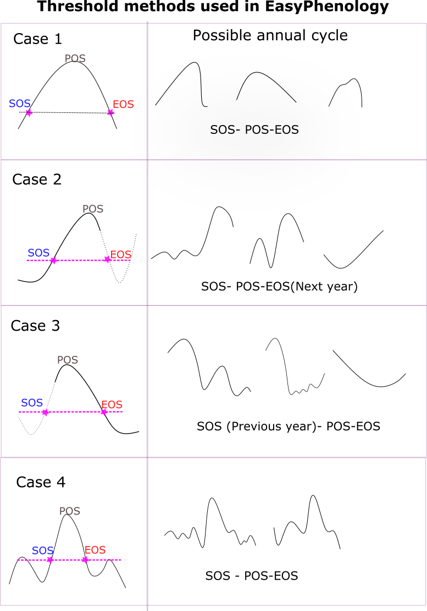

# EasyPhenology
EasyPhenology calculates phenological transition dates (PTDs) that are start of season (SOS), end of season (EOS), peak of season (POS) and growing season length (GSL). It is designed for Gross primary productivity (GPP) in eddy covariance data but can be used with other vegetation index.


## Table of content
- [Installation](#installation)
- [Description](#description)
    - [Integral Smoothing](#integral-smoothing)
    - [EasyPhenology](#EasyPhenology)
- [Test](#test)
    - [Data and Figure](#data)
    - [Overview from multiple sites](#allsites)
- [License](#license)
- [Authors and Acknowledgment](#authors-and-acknowledgment)
- [Project Status](#links)


### Installation
Requires: scipy, pandas, numpy, statsmodels, matplotlib 

Get the directory :
Enter to the the directory where you want to clone the repository and then enter:

```bat
git clone https://github.com/Panwar-MPI/EasyPhenology.git

```

or 

```bat
git clone https://github.com/Panwar-MPI/EasyPhenology.git

```

Directly download zip of the repository


### Description
This project consists of one .py file called EasyPhenology. Easyphenology.py has two functions that are 1) integral_smoothing and 2) EasyPhenology. Read the information on each function below. To calculate PTDS you just need to call function EasyPhenology. If you do not want to calculate PTDs but only are interested in smoothed time series of a variable use function integral_smoothing

### Integral Smoothing

```python
integral_smoothing(df)
```

Smooths the daily value of GPP using a novel approach called integral smoothing

This function requires an input dataframe(df) with columns in order 'time', 'year', 'doy' and 'Var'. Here 'doy' is the day of year and 'Var' is the variable of interest (eg., GPP). The data must he in daily time scale. This functions smooths variable Var in four steps. First step is to interpolate the missing value. A simple before fill and linear interpolate function is used for filling the missing values. Second step is to calculatee cumulative of the variable Var for each year. In third step the cumulative curve is smoothed using Savitzky–Golay smoothing. Since the cumulative values are already quite smooth so any basic smoothing function should produce similar smoothing. In the last step smoothed value of the variable is obtained from the first derivative of smoothed cumulative value. Year with more than 50 days of missing pass go through these steps. If a year has more than 50 nan values the smoothed values are all nan. 

Parameters:
df : a dataframe with columns : time, year, doy, Var. Var is the variable of interest

Returns:
df_smooth : the dataframe with columns time,year, doy and Var, where Var is the smoothed values


### EasyPhenology

```python
EasyPhenology(df, Threshold_value)
```

This function produces phenological transition dates (PTDs) for a given dataframe(df) and a Threshold_value (0 to 1)

It requires dataframe with columns in order 'time', 'year', 'doy' and 'Var'. These values 
should be in daily time scale. This function first smooths Var using our integral smoothing method and
then calculates phenological transition dates (PTDs). There are two methods to calculate PTDs. First is threshold method and second is the derivative method. The value of threshold should be provided in input. The derivative method looks for the maximum and minimum rate of change of GPP that are SOS and EOS of the year. 

Parameters:
df : a dataframe with columns : time, year, doy, Var. Var can be GPP, NEE, NDVI, GCC. Only Var=GPP is tested. Threshold for calculating PTDs.

Returns:
Pheno_out : the dataframe with columns "Year", "SOS", "POS", "EOS", "GSL", "SOS_der", "EOS_der","GSL_der"
df_smooth : the dataframe with columns time,year, doy and Var, where Var is the smoothed values of input Var




The figure above shows four cases of the annual GPP cycles that are treated in this function. CASE 1 and CASE4 has start and end of season in the same year. For CASE 2 end of season occurs in next year and for CASE3 start of season occurs in the previous year.These four cases are identified based on the threshold value and therefore are sensitive to it. To calculate PTDs from derivative method the year is first identified by cases based on threshold method. Therefore, PTDs derived from derivative method can be different for different threshold methods. 

For CASE 2 when EOS occurs in the next year the doy is 365 + doy(of the next year)
For CASE 3 when EOS occurs in the previous year the doy is doy(of the previous year) -365


### Test
Run test.py file. Input data "df_input.pkl" is provided in folder Data. It is a dataframe for a eddy covariance site DE-THA Evergreen needelleaf forest Germany. To apply function EasyPhenology on this dataframe run

```python
python3 test.py 
```

The output of the Integral smoothing and Easyphenology are shown in the figure below


Grey lines in the uppermost plot are the raw GPP values and the black lines are the smoothed output from EasyPhenology using integral_smoothing function.

The lowermost plot shows SOS (red), POS (black) and EOS (blue) calculated with threshold and derivative methods. Here, negative values of SOS means that the season of the present year started the previous year. Similarly EOS values greater than 365 means that the end of season takes place in the following year.

### Authors and Acknowledgment
Annu Panwar

Email: apanwar@bgc-jena.mpg.de

EasyPhenology is currently used in a DFG funded PhenoFeedBacks project 


### License
GNU AFFERO GENERAL PUBLIC LICENSE

### Project status
Initial stage, ready for use. Please contact if you are interested in sharing your results obtained from this function.
